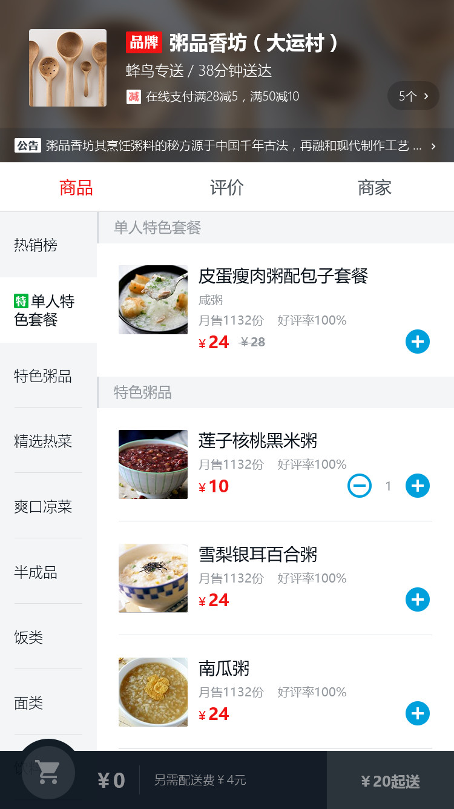
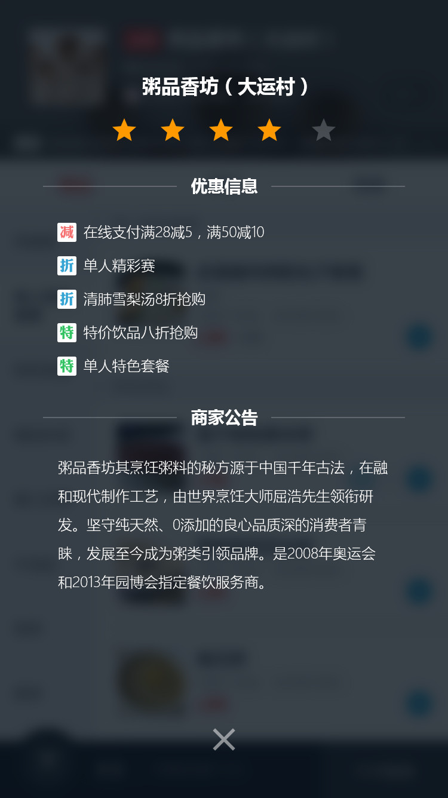

> Vue.js是一套构建用户界面的渐进式框架,其便于上手并且各种文档齐全，受到越来越多开发者的青睐。我作为前端小白，一次偶然的机会接触到了Vue.js,光看教程和简单Demo很难深入理解Vue的开发流程以及注意事项。 最近使用vue2.0开发了高仿饿了么点餐系统来练练手(项目源于某课付费课程)，在这里和大家分享一下

# 饿了么点餐系统
## 项目截图
&nbsp;&nbsp;&nbsp;&nbsp;

## 涉及技术
> vue2.0、vue-cli、vue-router、webpack、eslint、better-scroll、数据Mock
## 组件

* 购物车
* 购买物品小球飞入动画
* 评价star组件
* 商品添加、删除组件
* 优惠图标组件
* 目录、列表联动滚动
* 评论的是否满意和内容筛选
* 商品列表页面
* 店铺评价页面
* 商家介绍页面
* 优惠活动页面
* 商品详情页面

## 脚手架工具

[vue-cli](https://github.com/vuejs/vue-cli)  的脚手架项目官网给出了两个模板： webpack-simple 和 webpack 两种，现在自己在用的是webpack。
vue-cli除了根据模板创建代码目录结构之外还给出了webpack开发环境以及生产环境的配置信息，方便用户使用。除此之外，还提供了诸如：

- 代码热更新。
- PostCss。
- Eslint。
- bable。
- ...

## 环境搭建

``` bash
# install dependencies
npm install
```
## 开发环境
```
# serve with hot reload at localhost:8080
npm run dev
```

## 生产环境
```
# build for production with minification
npm run build
```


